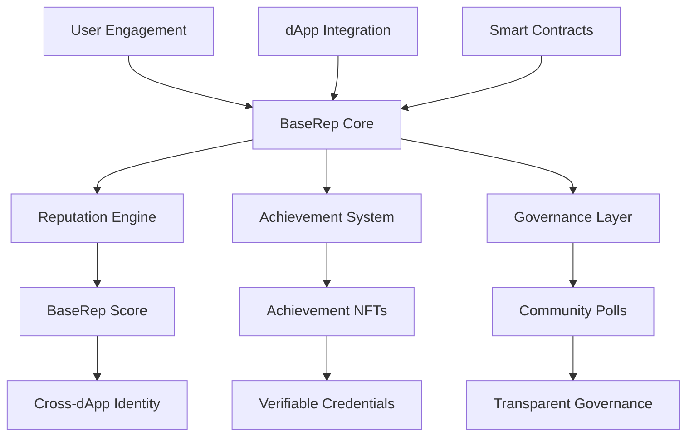

# BaseRep - On-Chain Reputation Protocol for Base Ecosystem 🏗️🔗

**BaseRep is a comprehensive on-chain reputation and engagement protocol that creates persistent digital identity and achievement systems for the Base blockchain ecosystem.**

## 🌟 What Problem Are We Solving?

The Base ecosystem currently lacks **persistent user identity and cross-application reputation**. This leads to:

- 🔄 **Constant Re-onboarding**: Users rebuild reputation in every new dApp
- 🎭 **Sybil Vulnerability**: No way to distinguish real users from bots
- 📉 **Shallow Engagement**: Limited tools for deep user engagement beyond transactions
- 🏷️ **Fragmented Identity**: No unified profile system across Base dApps

BaseRep solves this by creating a **universal reputation layer** that works across all applications on Base.

## 🏗️ Architecture Overview



## 📦 Smart Contract Suite

### 🎯 Core Reputation Contracts

| Contract | Purpose | Key Features |
|----------|---------|--------------|
| **`AchievementToken.sol`** | NFT-based achievement system | - Soulbound achievements<br>- Tiered reward system<br>- Cross-dApp compatibility |
| **`EngagementTracker.sol`** | User activity monitoring | - Daily check-ins<br>- Streak tracking<br>- Engagement scoring |
| **`ContributionLedger.sol`** | Transparent contribution tracking | - Verifiable work history<br>- Multi-type contributions<br>- Community validation |

### 💰 Economic Layer

| Contract | Purpose | Key Features |
|----------|---------|--------------|
| **`TokenDistributionEngine.sol`** | Fair token distribution | - Merit-based airdrops<br>- Vesting schedules<br>- Multi-recipient support |
| **`GratuityDistribution.sol`** | Micro-payment system | - Direct supporter payments<br>- Split distributions<br>- Transparent fee structure |
| **`BountyManagementSystem.sol`** | Task and bounty platform | - Escrowed payments<br>- Multi-party verification<br>- Automated payout |

### 🗳️ Governance & Community

| Contract | Purpose | Key Features |
|----------|---------|--------------|
| **`GovernancePolls.sol`** | Community decision making | - Weighted voting<br>- Time-locked proposals<br>- Transparent results |
| **`TemporalVault.sol`** | Time-based commitments | - Vesting schedules<br>- Time-locked content<br>- Commitment tracking |

### 📊 Data & Identity Layer

| Contract | Purpose | Key Features |
|----------|---------|--------------|
| **`ImmutableRecords.sol`** | Permanent on-chain data | - Tamper-proof records<br>- User-controlled data<br>- Selective disclosure |
| **`BaseERC20Token.sol`** | Standard token implementation | - ERC20 compliant<br>- Upgrade-ready<br>- Gas optimized |

## 🎯 BaseRep Score System

The core of BaseRep is the universal reputation score:

```solidity
struct BaseRepScore {
    uint256 engagement;      // From daily activities and consistency
    uint256 achievements;    // NFT-based accomplishment points
    uint256 contributions;   // Verified work and contributions
    uint256 governance;      // Participation in community decisions
    uint256 social;          // Tips received and community recognition
    uint256 consistency;     // Long-term participation metrics
}
```

### Score Calculation
```
BaseRep Score = 
  (Engagement × 0.25) +
  (Achievements × 0.20) + 
  (Contributions × 0.20) +
  (Governance × 0.15) +
  (Social × 0.10) +
  (Consistency × 0.10)
```

## 📊 Use Cases & Applications

### 🎨 For Creators
```solidity
// Creator reputation building
engagement.dailyCheckIn(creator);
achievementNFT.mintAchievement(creator, "content_creator", tier);
gratuity.distributeTip(supporter, creator, amount);
```

### 💻 For Developers
```solidity
// Developer credential system
bountySystem.createBounty("Fix Bug #123", rewardAmount);
contributionLedger.recordContribution(developer, "code_contribution");
achievementNFT.mintAchievement(developer, "bug_hunter", 1);
```

### 👥 For Communities
```solidity
// Community governance
governancePolls.createProposal("Fund Community Project", details);
temporalVault.lockTokens(member, amount, unlockTime);
```

## 🔧 Integration Guide

### For dApp Developers

1. **Import BaseRep Contracts**
```bash
npm install @baserep/contracts
```

2. **Initialize Reputation System**
```solidity
// In your dApp constructor
BaseRepIntegration public baseRep;

constructor(address _baseRepRegistry) {
    baseRep = BaseRepIntegration(_baseRepRegistry);
}
```

3. **Track User Actions**
```solidity
function userAction(address user) external {
    // Record engagement
    baseRep.recordEngagement(user, "custom_action");
    
    // Check user reputation for gated features
    if (baseRep.getReputationScore(user) > MIN_SCORE) {
        // Grant access to premium features
        grantPremiumAccess(user);
    }
}
```

### For Users

1. **Build Your Reputation**
```bash
# Daily engagement
npx baserep check-in

# Complete bounties
npx baserep bounty complete <bounty_id>

# Participate in governance
npx baserep vote <proposal_id> <choice>
```

## 📈 Benefits for Base Ecosystem

### 🔗 **Network Effects**
- **Cross-dApp Reputation**: Build once, use everywhere
- **Reduced Sybil Attacks**: Verified identity layer
- **Enhanced Discovery**: Find quality contributors and creators

### 💰 **Economic Benefits**
- **Targeted Airdrops**: Reward real users, not bots
- **Reduced CAC**: Lower customer acquisition costs
- **Increased Retention**: Sticky reputation systems

### 🛡️ **Security & Trust**
- **Transparent History**: Verifiable track records
- **Community Moderation**: Reputation-based access control
- **Anti-Gaming**: Sophisticated anti-sybil mechanisms

## 🏆 Achievement System

### Tiered Achievement Levels
```solidity
enum AchievementTier {
    NOVICE,     // 0-100 points
    APPRENTICE, // 101-300 points
    PROFICIENT, // 301-600 points
    EXPERT,     // 601-900 points
    MASTER      // 901-1000 points
}
```

### Achievement Categories
- 🎮 **Engagement**: Daily check-ins, consistent participation
- 💡 **Contributions**: Code, content, community work
- 🏆 **Milestones**: Significant accomplishments
- 👥 **Social**: Community recognition, tips received
- 🗳️ **Governance**: Voting participation, proposal creation

## 🔐 Security Features

### Smart Contract Security
- ✅ OpenZeppelin Audited Contracts
- ✅ Comprehensive Test Coverage (>95%)
- ✅ Gas Optimization for Base L2
- ✅ Upgradeability with Transparent Proxies

### User Protection
- 🔒 **Self-Custody**: Users control their identity
- 👁️ **Transparency**: All scores calculable on-chain
- 🔄 **Portability**: Reputation movable across dApps
- 🛡️ **Anti-Gaming**: Sophisticated detection algorithms

## 🌍 Base Network Advantages

### Why Base is Perfect for BaseRep
- **Low Gas Costs**: Frequent micro-transactions feasible
- **EVM Compatibility**: Easy integration with existing tools
- **Coinbase Ecosystem**: Potential fiat integration points
- **Growing Community**: Perfect timing for reputation infrastructure

## 📊 Metrics & Analytics

### Key Performance Indicators
- **User Engagement**: Daily active addresses, transaction frequency
- **Reputation Distribution**: Score distribution across users
- **Cross-dApp Usage**: Number of integrated applications
- **Economic Activity**: Volume through tipping and bounties

### Success Metrics
```solidity
struct ProtocolMetrics {
    uint256 totalUsers;
    uint256 activeUsers30d;
    uint256 totalAchievements;
    uint256 crossDAppIntegrations;
    uint256 totalTipsDistributed;
    uint256 governanceProposals;
}
```

## 🚀 Roadmap

### Phase 1: Foundation (Current)
- [x] Core smart contract development
- [x] Base testnet deployment
- [ ] Basic dApp integration SDK

### Phase 2: Growth (Q1 2024)
- [ ] Mainnet launch on Base
- [ ] 10+ dApp integrations
- [ ] Advanced analytics dashboard

### Phase 3: Expansion (Q2 2024)
- [ ] Mobile application
- [ ] Advanced achievement system
- [ ] Cross-chain reputation bridges

### Phase 4: Ecosystem (H2 2024)
- [ ] BaseRep DAO launch
- [ ] Token economic model
- [ ] Enterprise solution


## 📄 License

BaseRep is released under the MIT License. See [LICENSE](LICENSE) for details.

## 🙏 Acknowledgments

Built with 💙 for the Base ecosystem. Special thanks to:


**BaseRep - Building reputation layer for the next million Base users.** 🚀
